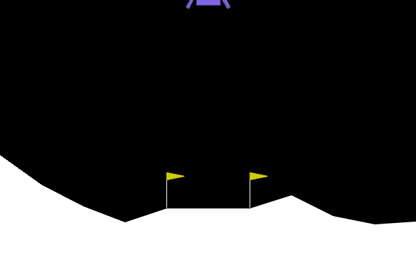
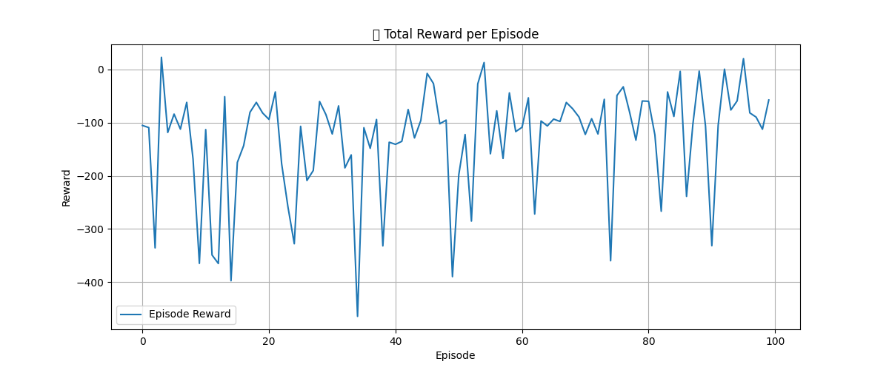
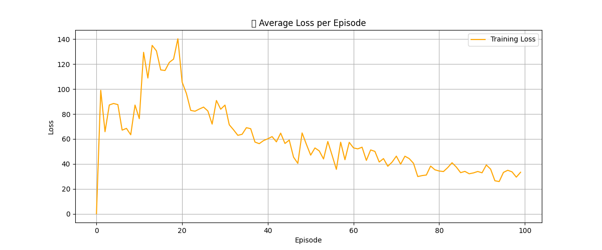

# lunar-landar-dqn

## 🚀 Agent Demo

Here’s how the trained DQN agent lands the Lunar Lander after learning from 1000 episodes of training:

## 📊 Training Performance

The agent was trained on the LunarLander-v3 environment using Deep Q-Learning. Below are the training performance plots:

### 🚀 Reward per Episode

### 📉 Average Loss per Episode

